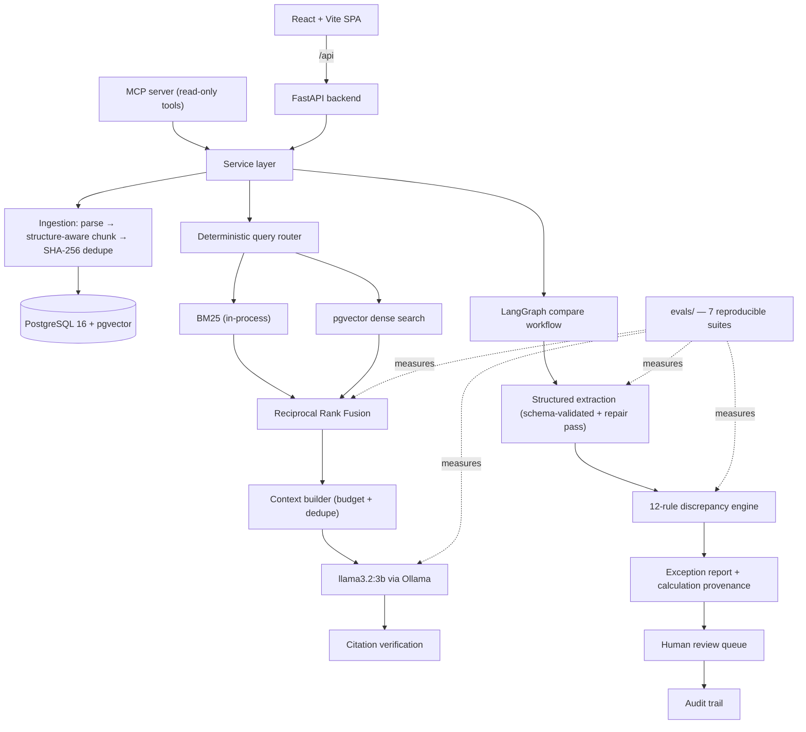
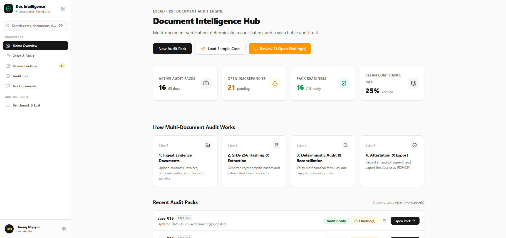
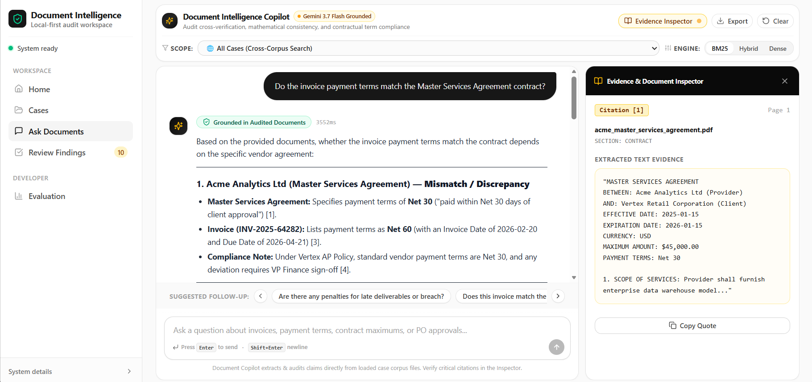
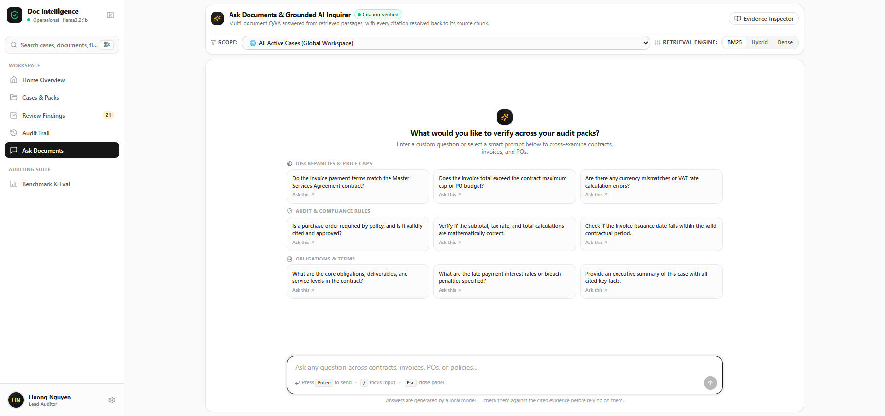
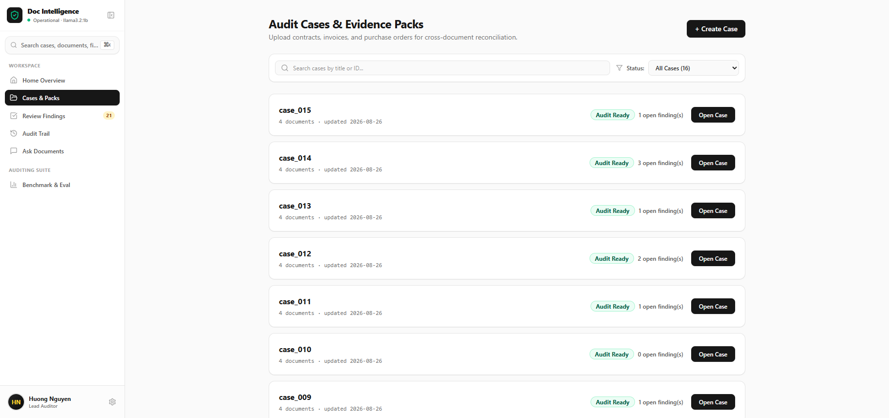
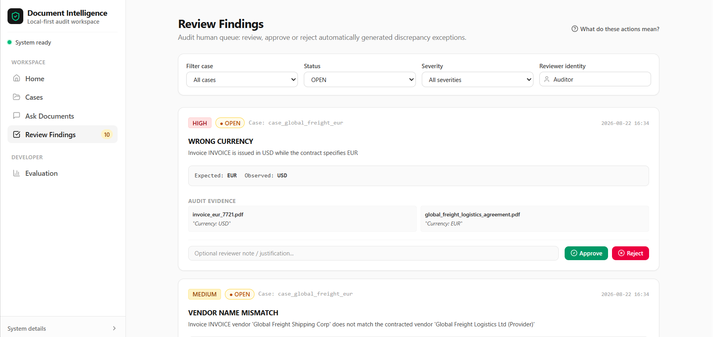
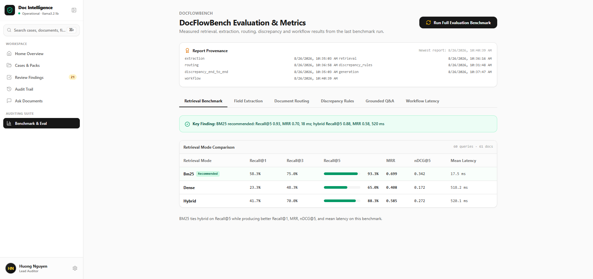

# 🏛️ Document Intelligence & Cross-Verification Copilot

<div align="center">

[](https://www.python.org/)
[](https://fastapi.tiangolo.com/)
[](https://github.com/pgvector/pgvector)
[](https://ollama.com/)
[](https://langchain-ai.github.io/langgraph/)
[](https://reactjs.org/)
[](LICENSE)

</div>

> A **local-first** document intelligence platform that cross-examines packs of business documents (service agreements, purchase orders, invoices, AP policies), detects inconsistencies with deterministic rules, and answers questions with page-level evidence citations — running entirely on a consumer laptop with a small local model and **no paid AI APIs**.

---

## 📌 Problem statement & core thesis

The expensive failures in accounts payable do not live inside a single document — they live **between** documents. An invoice that exceeds the contract cap. A currency that silently changed. Payment terms that drifted from what was signed. A duplicate invoice number carrying a different total.

Checking this by hand is slow. Handing it to an unconstrained chatbot is unauditable.

This project takes the third path, and it is the entire point of the repository:

> **Reliability comes from system design, not model size.**

The model is the smallest part of the answer. Everything software can decide, software decides:

| Concern | Who decides | Why |
|---|---|---|
| Financial comparisons & differences | **Python** (`Decimal`, storing formula + operands as provenance) | An LLM must never do arithmetic a controller will act on |
| Which documents are inconsistent | **12 deterministic rules** over normalised values | Reproducible, explainable, testable — scores F1 = 1.00 against ground truth |
| Query routing | **Deterministic keyword rules** | Measured: 92.5% vs 82.5% for the LLM on the same labelled set — and the gap held when the model was upgraded |
| Ranking & fusion | **Reciprocal Rank Fusion in Python** | Deterministic, no model in the loop |
| Citations | **Built by software before generation**, verified after | The model may only reference IDs it was handed; invented IDs are stripped |
| Approval of findings | **A human**, through a persisted review queue | The system never claims accounting authority |

The LLM is left with the bounded jobs it can actually do: schema-validated field extraction and evidence-grounded answer synthesis.

The default model is `llama3.2:3b`, chosen by measurement rather than by preference — [`docs/model-comparison.md`](docs/model-comparison.md) publishes the full head-to-head against `llama3.2:1b`, and [ADR 006](docs/adr/006-model-upgrade-to-3b.md) records the reasoning. Notably, three of the seven evaluations produced **identical** numbers under both models, because no LLM participates in them.

---

## 🛠️ System architecture



**Embeddings** use a dedicated 45 MB encoder (`all-minilm`) rather than the generation model — a generation model makes a poor embedder, and separating the two frees the LLM for generation.

---

## 📸 Product tour

<p align="center">
  
  <br/><em>Workspace home: case readiness, open findings and system status, all read from the running backend.</em>
</p>

### 1. Grounded Q&A with an evidence inspector

<p align="center">
  
  <br/><em>Every factual claim carries a citation marker. Clicking it opens the exact chunk — verbatim text, document, page, section.</em>
</p>

The model receives only retrieved evidence blocks and may cite only the identifiers it was given. Citations are constructed deterministically *before* generation and verified *after*: any marker that does not resolve to a stored chunk is detected and stripped rather than displayed.

<p align="center">
  
</p>

### 2. Case & document-pack management

<p align="center">
  
  <br/><em>A case groups a document pack. Readiness is computed from what has actually been ingested and indexed.</em>
</p>

### 3. Human-in-the-loop review queue

<p align="center">
  
  <br/><em>Each finding shows severity, the deterministic calculation behind it, and its evidence. States: OPEN → APPROVED/REJECTED → RESOLVED, with reviewer and timestamp persisted.</em>
</p>

### 4. Benchmark & evaluation dashboard

<p align="center">
  
  <br/><em>The dashboard renders the JSON reports generated by the evaluation suite. It never displays a number the suite did not produce — sections without a report say so.</em>
</p>

---

## 📊 Benchmark results

Every number below was produced by `python -m evals.run_all --cases 15` on the hardware described further down, against the **DocFlowBench** synthetic corpus, and written to [`evals/reports/`](evals/reports/). Run date: **2026-08-26**. Nothing here is hand-written — regenerate it and the claims either reproduce or they do not.

| Evaluation | Result | Detail |
|---|---|---|
| **Discrepancy rules** (perfect extraction) | **P/R/F1 = 1.00** | 14/14 ground-truth anomalies, 0 false positives |
| **Structured extraction** (`llama3.2:3b`) | **99.8%** field accuracy · **100%** schema validity | contract 100% · PO 100% · invoice 99.5% · policy 100% · median 3.1 s/doc |
| **Retrieval** — BM25 | **Recall@5 0.93** · MRR 0.70 · **16.4 ms** | recommended default |
| **Retrieval** — dense (pgvector) | Recall@5 0.65 · MRR 0.41 · 663 ms | |
| **Retrieval** — hybrid RRF | Recall@5 0.88 · MRR 0.58 · 618 ms | |
| **Query routing** | **92.5%** deterministic | LLM-assisted 85.0% · LLM-only 82.5% |
| **Discrepancy detection, end-to-end** | P **100%** · R 92.9% · **F1 0.96** | 13 TP / 0 FP / 1 FN across 15 cases |
| **Grounded Q&A citations** | present **100%** · valid **100%** · correct document **98%** | 60 queries · median 1,164 ms · p95 1,537 ms |
| **Workflow success** | **15/15 completed** · review-task consistency **100%** | median 12.8 s per case · 0 extraction failures |

> **Read the precision figure carefully.** 100% precision means 13 findings with zero false alarms *on this run* — 15 cases, 14 ground-truth anomalies, one pass over a synthetic corpus with regular layouts. It is a real measurement, not a general guarantee, and real-world documents would be harder.

### The three results worth discussing in an interview

**1. Deterministic routing beats the LLM — and kept beating it after the model was upgraded.**
Keyword rules score **92.5%** on the labelled routing set. `llama3.2:1b` scored 20% zero-shot, 67.5% few-shot; `llama3.2:3b` improved to 82.5% — still below the rules. Keyword-first-then-LLM lands at 85.0%, so the model *degrades* an already-good decision either way. `ROUTER_LLM_ENABLED=false` is the default, and the routing report keeps all four variants side by side as the evidence. A decision that survives a model upgrade is a design choice, not a workaround.

**2. One misleading word in a prompt cost 53 points of field accuracy — and caused most of the false alarms.**
Running on `llama3.2:1b`, end-to-end precision was 52%: 11 false findings against 12 real ones. Because the discrepancy engine is deterministic, the error was *attributable* and could be traced rather than guessed:

* 7 of the 11 false positives came from a single rule, `incorrect_tax_calculation` (precision 0.125);
* that rule depends on one field, `tax_rate_percent`, which extracted at **47.1%** while every other invoice field scored ≥88%;
* sampling real documents showed the model was not noisy but *biased*: it read 8% and 10% correctly and returned **10 for every 5% invoice**;
* the prompt itself was the anchor — it said `tax_rate_percent: the percentage inside "Tax (...%)", e.g. "10"`.

Removing the example took that field from 47.1% to 100% **on the same 1B model**, and reading the labelled rate straight from the document text (`app/extraction/patterns.py`, model consulted only when no pattern matches) made it robust. End-to-end precision rose 52.2% → 63.2%, F1 0.65 → 0.73, with recall unchanged.

The lesson is the sequencing: had the model been upgraded first, this prompt bug would have been *masked* rather than fixed.

**3. Then the model upgrade removed what was actually left — and quantified it.**
The residual errors were genuine capacity limits: misread `subtotal`, `tax` and `total` values. Swapping the model is one environment variable, so it was measured rather than assumed:

| | `llama3.2:1b` | `llama3.2:3b` |
|---|---|---|
| Extraction field accuracy | 97.5% | **99.8%** |
| End-to-end false positives | 7 | **0** |
| End-to-end precision | 63.2% | **100%** |
| End-to-end F1 | 0.73 | **0.96** |
| Citations valid | 90% | **100%** |
| Extraction latency (median/doc) | 1,623 ms | 3,126 ms |
| Full case analysis (median) | 11.2 s | 12.8 s |
| Discrepancy rules · retrieval · workflow | — | **identical** |

Per-document extraction nearly doubles in cost, but a full case analysis slows by only 14%, because extraction is one stage among several deterministic ones. Full write-up: [`docs/model-comparison.md`](docs/model-comparison.md) · decision record: [ADR 006](docs/adr/006-model-upgrade-to-3b.md).

The last row is the architectural point stated as a measurement: **three of the seven evaluations did not move at all**, because no LLM participates in them.

---

## 🧪 DocFlowBench: the synthetic benchmark

Public invoice datasets rarely ship as *related packs with labelled cross-document inconsistencies*, so the repository generates its own, deterministically:

```bash
python -m synthetic_data.generator --seed 42 --cases 30
```

Same seed → byte-identical PDFs and ground truth. Each case is a contract + purchase order + invoice(s) + AP policy rendered as real PDFs, with ground-truth JSON covering **12 anomaly types** (amount exceeds contract, PO mismatch, wrong currency, vendor mismatch, duplicate invoice, date outside contract term, inconsistent payment terms, missing required field, incorrect tax, incorrect total, conflicting invoice number, policy violation) plus deliberately clean cases, in obvious and subtle variants.

---

## ✨ Capabilities

* **Ingestion** — PDF / DOCX / TXT / MD / CSV, structure-aware chunking that never splits a table, SHA-256 content dedupe, MIME sniffing by magic bytes (never by extension).
* **Structured extraction** — Pydantic schemas enforced through Ollama constrained decoding at temperature 0, with a corrective retry and a **single-field repair pass** for anything left null.
* **Hybrid retrieval** — BM25 + pgvector dense + RRF, with metadata filters (case, document type, filename).
* **12-rule discrepancy engine** — normalised comparison of vendor, currency, terms, dates, totals, tax and caps; every numeric finding carries `formula`, `operands` and `result`.
* **LangGraph workflow** — an explicit state machine (load → extract → rules → review tasks → report), persisted with its step trace; extraction failures force human review rather than passing silently.
* **Human review queue** — single and batch decisions, reviewer identity and timestamps persisted.
* **Audit trail** — actions are appended to an `audit_events` table at the moment they happen, SHA-256 hash-chained, behind a database trigger that rejects `UPDATE` and `DELETE`. Events recorded before the ledger existed are still projected from the live tables at read time; every entry is labelled `ledger` or `projected`, and chain validity is reported separately for each.
* **Read-only MCP server** — exposes search, document fields, comparison and review findings to MCP-compatible clients without granting write access.

---

## 🛡️ Reliability & guardrails

* Structured outputs are Pydantic-validated with a corrective retry; persistent failures are recorded as failed extraction runs — **never silently filled with invented values** (nullable fields are mandatory wherever evidence may be absent).
* Retrieved document text is treated as untrusted data; system prompts pin the model to evidence-only behaviour against prompt injection.
* Tools are allowlisted with typed input/output contracts; the model has **no SQL, file or shell access**.
* Upload size limits, path-traversal-safe storage (server-generated UUID filenames), MIME validation.
* Separate `product` / `test` / `eval` databases with a hard guard (`assert_safe_database_url`) that refuses to point a test or evaluation run at production data.
* Structured JSON logging on every LLM call (tokens, durations, retries, schema validity), retrieval (mode, candidates, latency) and workflow (steps, status, review flags).

---

## 💻 Designed for consumer hardware

```text
AMD Ryzen 5 6600H · 16 GB RAM · RTX 3050 4 GB · Windows 11
```

The constraint is the feature: a 3B generation model (2.0 GB) plus a 45 MB embedder, pgvector instead of a vector-database service, in-process BM25 instead of Elasticsearch, one container of infrastructure, ~4096-token contexts, batched embeddings. Everything still runs CPU-only if the GPU is unavailable.

---

## 🚀 Quick start

**Prerequisites:** Python 3.12+, Node.js 18+, Docker Desktop, [Ollama](https://ollama.com).

```bash
# 1. Models (one-time, ~2.1 GB total)
ollama pull llama3.2:3b
ollama pull all-minilm

# 2. One-shot setup: Postgres + databases + venv + migrations + benchmark corpus
scripts/bootstrap.sh          # Windows: scripts\bootstrap.ps1

# 3. Frontend dependencies
npm install
```

`bootstrap` starts the `pgvector/pgvector:pg16` container, creates the `docintel_product` / `docintel_test` / `docintel_eval` databases, builds `.venv`, applies Alembic migrations and generates the DocFlowBench corpus. Copy `.env.example` to `.env` first if you need non-default ports.

**Run it:**

```bash
# Terminal 1 — API on http://127.0.0.1:8001
.venv/bin/uvicorn app.api.main:app --port 8001 --reload

# Terminal 2 — UI on http://localhost:5173 (proxies /api to the backend)
npm run dev
```

`GET /ready` verifies PostgreSQL, Ollama and both models, returning actionable hints (e.g. `ollama pull all-minilm`) when something is missing. Interactive OpenAPI docs live at `/docs`.

---

## ✅ Tests & evaluations

```bash
pytest -m "not ollama and not integration"   # fast suite — no services required
pytest -m integration                        # + live PostgreSQL
pytest -m ollama                             # + live Ollama
npm run lint                                 # tsc --noEmit

python -m evals.run_all --cases 15           # full suite (requires EVAL_DATABASE_URL)
python -m evals.run_all --skip-llm           # deterministic evaluations only (CI-safe)
```

Reports are written to `evals/reports/*_latest.{json,md}` plus a consolidated `latest.md`, and the Evaluation view renders exactly those files.

---

## 📡 API reference

All application routes are served under `/api`; `/health` and `/ready` are additionally exposed bare for container probes.

```text
GET    /api/ready                        POST   /api/query
GET    /api/cases                        POST   /api/search
POST   /api/cases                        POST   /api/compare
GET    /api/cases/{id}                   GET    /api/workflows/{id}
DELETE /api/cases/{id}                   GET    /api/reviews
POST   /api/cases/{id}/documents         POST   /api/reviews/{id}/approve|reject|resolve
POST   /api/cases/{id}/analyses          POST   /api/reviews/batch
POST   /api/demo/cases                   GET    /api/audit-trail
GET    /api/documents                    GET    /api/audit-trail/export
GET    /api/documents/{id}               GET    /api/evals
GET    /api/documents/{id}/chunks        POST   /api/evals/run
GET    /api/documents/{id}/extraction    GET    /api/evals/runs/{id}
DELETE /api/documents/{id}
POST   /api/documents/{id}/index
```

`POST /api/cases/{id}/analyses` returns `202` with a workflow id — poll `GET /api/workflows/{id}` for step-by-step progress. `POST /api/evals/run` launches the real evaluation subprocess and returns a run id; it never returns metrics.

---

## 📂 Repository structure

```text
app/                          FastAPI backend
├── api/
│   ├── dependencies.py       lazily-built service singletons
│   ├── main.py               app factory; every router mounted under /api
│   └── routes/
│       ├── audit.py          audit trail + CSV/JSON export
│       ├── cases.py          case CRUD, pack upload, async analyses
│       ├── compare.py        cross-document discrepancy workflow
│       ├── documents.py      ingest, list, chunks, stored extraction
│       ├── evals.py          read reports, launch a real benchmark run
│       ├── health.py         /health and /ready probes
│       ├── query.py          grounded Q&A
│       ├── retrieval.py      search + embedding index
│       ├── reviews.py        single and batch review decisions
│       └── workflows.py      workflow run status and step trace
|
├── agents/
│   ├── graph.py              LangGraph compare workflow
│   ├── router.py             deterministic query router
│   ├── state.py              workflow state + step recording
│   └── tools.py              typed, allowlisted tools
|
├── ingestion/
│   ├── chunking.py           structure-aware chunking
│   ├── pipeline.py           bytes → elements → chunks
│   ├── types.py
│   └── parsers/              pdf · docx · text · csv · registry (MIME sniffing)
|
├── extraction/
│   ├── patterns.py           deterministic reads of labelled fields
│   ├── schemas.py            Pydantic extraction schemas
│   └── service.py            constrained decoding + single-field repair pass
|
├── discrepancy/
│   ├── engine.py             the 12 deterministic rules
│   ├── evidence.py
│   ├── models.py
│   └── normalize.py          vendor / currency / terms normalisation
|
├── retrieval/
│   ├── bm25.py               in-process lexical search
│   ├── vector.py             pgvector dense search
│   ├── fusion.py             reciprocal rank fusion (k=60)
│   ├── hybrid.py
│   ├── context.py            context budget + dedupe
│   ├── indexer.py            embedding indexer
│   └── service.py
|
├── citations/
│   ├── builder.py            citations built before generation
│   ├── models.py
│   └── verifier.py           invented markers detected and stripped
|
├── llm/
│   ├── base.py               LLMProvider protocol + telemetry
│   ├── ollama.py             structured outputs with corrective retry
│   └── prompts/              versioned prompt files + registry
|
├── embeddings/               provider protocol + Ollama embeddings
|
├── services/
│   ├── audit.py              read-time projection of audit events
│   ├── audit_ledger.py       append-only hash-chained ledger
│   ├── cases.py
│   ├── compare.py
│   ├── documents.py
│   ├── evals_runner.py       spawns the real evaluation subprocess
│   ├── hints.py
│   ├── qa.py                 route → retrieve → cite → verify
│   └── reviews.py
|
├── models/                   SQLAlchemy models (audit, case, document, …)
├── repositories/             data access
├── workflows/report.py       exception report generation
├── core/                     config, logging, exceptions
└── db/                       engine + session

src/                          React + Vite workspace
├── App.tsx
├── api.ts                    fetch wrapper + polling helper
├── types.ts                  the API contract the backend matches
├── components/               Home · Cases · Ask · Reviews · AuditTrail ·
│                             Evaluation · SplitViewer · CommandPalette · Sidebar
├── context/                  theme + language
└── utils/                    export + document text helpers

evals/                        7 reproducible evaluation suites
├── common.py                 benchmark loading, report writing, metrics
├── database.py               eval-database guard
├── run_all.py                python -m evals.run_all
├── extraction/run.py
├── retrieval/run.py
├── routing/run.py
├── discrepancy/run.py
├── generation/run.py
├── workflow/run.py
└── reports/                  generated JSON + Markdown (committed)

tests/
├── conftest.py
├── unit/                     25 files — parsers, chunking, rules, router, citations, ledger, extraction, evals framework
├── integration/              10 files — live PostgreSQL: documents, cases, compare workflow, reviews batch,...
└── ollama/                   live-model smoke tests (excluded from CI)

synthetic_data/generator/     DocFlowBench: seeded PDFs + ground truth
mcp_server/                   read-only MCP tools over existing services
migrations/versions/          Alembic migrations
docs/
├── adr/                      6 architecture decision records
├── images/                   product screenshots used in this README
├── mcp.md                    MCP client setup
└── model-comparison.md       1B vs 3B head-to-head
scripts/                      bootstrap + database provisioning
```

---

## ⚠️ Known limitations

Stated plainly, because a portfolio that hides its edges is not worth reading:

* **The headline accuracy rests on a small synthetic sample.** 15 cases, 14 ground-truth anomalies, 60 Q&A queries, one run. Zero false positives is a property of this benchmark, not a promise about real invoices, whose layouts vary far more than DocFlowBench's templates.
* **The append-only ledger is tamper-*evident*, not tamper-proof, and it is not a compliance control.** The trigger blocks ordinary `UPDATE`/`DELETE`, but this application owns the table, so its own role can drop the trigger; `TRUNCATE` and `DROP TABLE` are not guarded; the chain has no external anchor, so anyone able to rewrite the whole table can recompute every hash; and deleting the newest rows breaks no link, so it cannot be detected from the chain alone. Four flows append (case created, document ingested, workflow finished, review decided/resolved) — everything else, and every event predating the ledger, is a read-time projection over mutable rows and is labelled as such in the response.
* **No authentication or multi-tenancy.** Reviewer identity is a free-text field. This is a single-user portfolio system, not a hosted product.
* **BM25 rebuilds its corpus per search** — fine at benchmark scale (~10³ chunks), documented as a scaling limit.
* **No OCR** — native-text PDFs, DOCX, TXT, MD and CSV only. Scanned documents are out of scope.
* **Citations are chunk/page-level**, not character-offset level.
* **Dense retrieval underperforms BM25 on this corpus** (0.65 vs 0.93 Recall@5), because business documents are dense with exact identifiers. The honest conclusion was to default to BM25 rather than ship hybrid because it sounds more sophisticated.

---

## 🔭 Future improvements

* Widen the benchmark (more cases, messier layouts) so the precision figure carries a tighter confidence interval.
* Optional cloud-provider fallback through the same `LLMProvider` protocol.
* An external anchor for the ledger chain (periodic digest published outside the database) so whole-table rewrites become detectable.
* Tesseract OCR path for scanned documents.
* CPU cross-encoder reranking behind `ENABLE_RERANKER` (scaffolded, disabled).
* Incremental BM25 indexing and pgvector HNSW tuning for larger corpora.

---

## 📄 License

MIT © Nguyen Trong Huong
