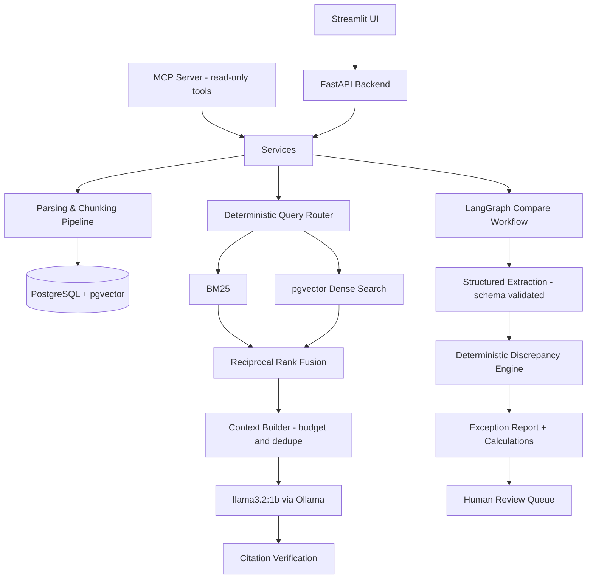

# Document Intelligence & AI Workflow Automation Platform

> A local-first AI engineering platform that converts business documents into structured knowledge, performs hybrid retrieval and cross-document reasoning, and generates evidence-backed discrepancy reports using a lightweight Ollama LLM — no paid APIs, no cloud dependency.

Built and evaluated entirely on a mid-range consumer laptop (Ryzen 5 6600H · 16 GB RAM · RTX 3050 4 GB), around `llama3.2:1b` — deliberately. The thesis of this project: **reliability comes from system design, not model size.**

## Why this project exists

Businesses handle packs of related documents — contracts, purchase orders, invoices, payment policies — and the expensive failures live *between* documents: an invoice that exceeds the contract cap, a currency that silently changed, payment terms that drifted from what was agreed. Checking this by hand is slow; handing it to an unconstrained chatbot is unauditable.

This platform does it differently:

- **Deterministic software decides everything software can decide** — financial comparisons, rank fusion, citation construction, routing — with full calculation provenance on every finding.
- **The 1B LLM performs only bounded tasks** (schema-validated extraction, evidence-grounded synthesis) behind Pydantic validation with corrective retries.
- **Humans approve consequential findings** through a persisted review queue before anything is treated as final.
- **Every capability is measured** by a reproducible evaluation suite against a deterministic synthetic benchmark — no metric in this README exists that the eval scripts did not produce.

## The flagship workflow

Upload a document pack (`service_contract.pdf`, `purchase_order.pdf`, `invoice_001.pdf`, `payment_policy.pdf`), then ask the system to compare them. A LangGraph state machine extracts structured fields with the local model, runs twelve deterministic discrepancy rules over the normalized values, computes exact differences in Python, links each finding to page-level evidence, generates an exception report, and queues findings for human approval:

```text
Potential overbilling: $7,500
  invoice_total (82,500.00) - contract_maximum_amount (75,000.00) = 7,500.00
  Evidence: service_contract.pdf p.3 · invoice_001.pdf p.1
  [Approve Finding] [Reject Finding]
```

## Architecture



## AI engineering decisions (each backed by a measurement or an ADR)

| Decision | Why |
|---|---|
| **Llama 3.2 1B, local via Ollama** | Fits 4 GB VRAM with room for embeddings; forces the architecture to earn reliability instead of renting it ([ADR 001](docs/adr/001-local-first-llm.md)) |
| **Dedicated embedding model (`all-minilm`)** | Generation models make poor embedders; a 45 MB encoder outperforms and frees the LLM for generation |
| **Hybrid BM25 + dense + RRF** | Invoices are full of exact identifiers (BM25 territory) *and* paraphrased questions (dense territory); fusion is deterministic Python, never the LLM ([ADR 002](docs/adr/002-hybrid-retrieval.md)) |
| **Deterministic discrepancy rules** | Rules reproduce benchmark ground truth with F1 = 1.00 under perfect extraction, so end-to-end error is attributable to extraction — measurable and improvable in isolation ([ADR 003](docs/adr/003-deterministic-workflows.md)) |
| **Deterministic query routing by default** | Measured: keyword rules 92.5% accuracy vs 20% zero-shot / 67.5% few-shot for the 1B LLM; even keyword-first+LLM scored lower (82.5%), so `ROUTER_LLM_ENABLED=false` by default — the eval report holds all four measurements |
| **Citations created by software, verified after generation** | The model can only reference evidence IDs it was given; invented IDs are detected and stripped, and every citation resolves to a stored chunk |
| **Human-in-the-loop review** | High-severity findings become OPEN review tasks with reviewer identity and timestamps; the system never claims accounting authority ([ADR 005](docs/adr/005-human-in-the-loop.md)) |
| **PostgreSQL + pgvector only** | One database for relational data, vectors, and filtered retrieval; no second source of truth ([ADR 004](docs/adr/004-postgres-pgvector.md)) |

## DocFlowBench: the synthetic benchmark

Public invoice datasets rarely come as *related packs with labeled cross-document inconsistencies*, so the repo generates its own: seeded, byte-reproducible document packs (contract + PO + invoices + payment policy as real PDFs) with ground-truth JSON covering 12 anomaly types — from `amount_exceeds_contract` to `conflicting_invoice_number` — plus clean cases, in both obvious and subtle variants.

```bash
python -m synthetic_data.generator --seed 42 --cases 30
```

Same seed, same bytes — which makes every evaluation below reproducible.

## Evaluation results

All numbers below were produced by `python -m evals.run_all` on the machine described above and live in [`evals/reports/`](evals/reports/). Regenerate them yourself; the README is updated only from those reports.

<!-- BENCHMARK RESULTS — regenerated from evals/reports (15 cases, seed 42) -->

| Evaluation | Result |
|---|---|
| Discrepancy rules vs ground truth (perfect extraction) | precision / recall / F1 **1.00** |
| Structured extraction (llama3.2:1b) | field accuracy **96.6%** (invoice 93.6 / contract 99.0 / PO 98.7 / policy 100) · schema validity **100%** · median 1.49 s per document |
| Discrepancy detection end-to-end (LLM extraction) | precision **54.5%** · recall **85.7%** · F1 **66.7%** |
| Retrieval (Recall@5) | hybrid **0.93** · bm25 0.93 · dense 0.65 |
| Query routing accuracy | **92.5%** deterministic (LLM-assisted 82.5%, LLM-only few-shot 67.5%, zero-shot 20%) |
| Workflow success (/compare path) | completion **15/15** · review-task creation accuracy **100%** · median 14.2 s per case |
| Citation quality (end-to-end Q&A) | see `evals/reports/generation_latest.md` |

Two measured stories worth reading in the reports:

1. **Extraction went from 11.5% to 96.6% field accuracy without changing the model.** The failure was architectural, not parametric: an all-optional JSON schema let the 1B model satisfy constrained decoding with `{}`. Requiring every key as a copyable string, putting the document before the instructions, and adding a focused single-field repair pass for anything left null recovered 85 points. The eval suite caught it; git history documents each step.
2. **The gap between rules F1 (1.00) and end-to-end F1 (0.67) is the measured price of a 1B extractor.** With ~30 extracted fields per case, a single wrong field creates a false finding (precision 54.5%) or hides a real one (recall 85.7%). The error budget is fully attributable — extraction, not rules — which is exactly what the deterministic design was for.

## Reliability and guardrails

- Structured outputs are Pydantic-validated with one corrective retry; persistent failures are recorded as failed extraction runs — **never silently fabricated values** (nullable fields are mandatory where evidence may not exist).
- Retrieved document content is treated as untrusted data; system prompts pin the model to evidence-only behaviour against prompt injection.
- Tools are allowlisted with typed input/output contracts and structured errors; the model has no SQL, file, or shell access — ever.
- Path traversal, upload size, and MIME sniffing guards on ingestion (magic bytes, not extensions).
- Extraction failures force human review: silence never looks like a pass.
- Structured JSON logging on every LLM call (tokens, durations, retries, schema validity), retrieval (mode, candidates, latency), and workflow (steps, status, review flags).

## Designed for consumer hardware

```text
AMD Ryzen 5 6600H · 16 GB RAM · RTX 3050 4 GB · Windows 11
```

This constraint is a feature: a 1B generative model + 45 MB embedder, pgvector instead of a vector-DB service, in-process BM25 instead of Elasticsearch, one Docker container of infrastructure, ~4096-token contexts, and batch embedding. Everything still works CPU-only if the GPU is unavailable.

## Setup

Prerequisites: Python 3.12+, Docker Desktop, [Ollama](https://ollama.com) on the host.

One-shot setup: `scripts\bootstrap.ps1` (Windows) or `scripts/bootstrap.sh` (Linux/macOS/WSL2) — or step by step:

```bash
# 1. Models (one-time, ~1.4 GB total)
ollama pull llama3.2:1b
ollama pull all-minilm

# 2. Infrastructure (one container)
docker compose up -d postgres

# 3. Python environment
python -m venv .venv
# Windows: .venv\Scripts\activate      Linux/macOS: source .venv/bin/activate
pip install -e ".[dev]"

# 4. Configuration + schema
cp .env.example .env       # adjust POSTGRES_PORT / API_PORT if taken
alembic upgrade head

# 5. Generate the benchmark corpus
python -m synthetic_data.generator --seed 42 --cases 30

# 6. Run the API and UI
uvicorn app.api.main:app --reload
streamlit run ui/app.py
```

`GET /ready` verifies PostgreSQL, Ollama, and both models — with actionable hints (e.g. `ollama pull all-minilm`) when something is missing.

Windows note: the project runs natively on Windows (no WSL2 required). WSL2 + Docker Desktop is also supported; on 16 GB machines cap the WSL2 VM (e.g. `memory=3GB` in `%USERPROFILE%\.wslconfig`) so the database backend cannot starve the host.

## Run tests

```bash
pytest -m "not ollama and not integration"   # fast suite — no services needed
pytest -m integration                        # + live PostgreSQL
pytest -m ollama                             # + live Ollama (local only)
```

## Run evaluations

```bash
python -m evals.run_all              # everything the environment supports
python -m evals.run_all --skip-llm   # deterministic evals only (CI-safe)
python -m evals.retrieval.run --cases 10
```

Reports land in `evals/reports/*_latest.{json,md}` plus a consolidated `latest.md`.

## API examples

```bash
# Upload a document
curl -F "file=@service_contract.pdf" -F "document_type=contract" -F "case_id=case_001" \
     http://localhost:8000/documents

# Index it for search, then ask a grounded question
curl -X POST http://localhost:8000/documents/{id}/index
curl -X POST http://localhost:8000/query -H "Content-Type: application/json" \
     -d '{"question": "What is the maximum contract amount?", "filters": {"case_id": "case_001"}}'

# Run the discrepancy workflow and review the findings
curl -X POST http://localhost:8000/compare -H "Content-Type: application/json" \
     -d '{"case_id": "case_001"}'
curl http://localhost:8000/reviews?status=OPEN
curl -X POST http://localhost:8000/reviews/{review_id}/approve \
     -H "Content-Type: application/json" -d '{"reviewer": "controller"}'
```

Interactive OpenAPI docs at `http://localhost:8000/docs`. A read-only [MCP server](docs/mcp.md) exposes search, document fields, comparison, and review findings to MCP-compatible clients (`python -m mcp_server`).

## Repository structure

```text
app/            FastAPI backend: api, core, llm, embeddings, ingestion, extraction,
                retrieval, citations, agents (router + LangGraph), discrepancy,
                workflows, services, repositories, models, db
synthetic_data/ DocFlowBench generator (seeded PDFs + ground truth)
evals/          7 evaluation suites + generated reports
mcp_server/     read-only MCP tools over existing services
ui/             Streamlit demo (Documents · Ask · Compare · Reviews · Evaluation)
migrations/     Alembic (async) schema migrations
tests/          unit · integration · ollama-marked live tests
docs/adr/       architecture decision records
```

## Known limitations

- `llama3.2:1b` extraction is the accuracy bottleneck — measured, not hidden; the per-field extraction report shows exactly where it fails. A configurable 3B model is the obvious first upgrade path.
- BM25 rebuilds its corpus per search — fine at benchmark scale (~10³ chunks), documented as a scale limitation.
- OCR for scanned PDFs is not implemented (native-text PDFs, TXT, MD, DOCX, CSV are).
- Citation granularity is chunk/page-level, not character-offset level.
- Single-machine, single-tenant design — no auth layer; it is a portfolio system, not a hosted product.

## Future improvements

- Swap-in `llama3.2:3b` (fits 4 GB VRAM at Q4) behind the existing provider abstraction, and publish the before/after eval delta.
- Optional cloud-provider fallback via the same `LLMProvider` protocol.
- Tesseract OCR path for scanned documents.
- CPU cross-encoder reranking behind `ENABLE_RERANKER` (scaffolded, disabled).
- Incremental BM25 indexing and pgvector HNSW tuning for larger corpora.

## License

MIT © Arthur Nguyen
