# 🏛️ Document Intelligence & Cross-Verification Copilot

[](https://www.typescriptlang.org/)
[](https://reactjs.org/)
[](https://tailwindcss.com/)
[](https://expressjs.com/)
[](https://ai.google.dev/)
[](LICENSE)

> A modern, audit-grade Document Intelligence platform that cross-examines packs of business documents (Master Services Agreements, Invoices, Purchase Orders, and AP Policies), performs deterministic anomaly detection, and provides grounded conversational Q&A with interactive page-level evidence citations.

---

## 📌 Problem Statement & Core Thesis

Enterprise finance and procurement teams handle document packs across multiple vendors. Critical failures and expensive compliance leaks routinely hide **between related documents**:

* **Invoice Overbilling**: An invoice line item or total exceeding the contracted price cap or approved PO budget.
* **Payment Term Drift**: Payment terms subtly drifting (e.g., Net 15 vs. Net 45) from Master Agreements.
* **Tax Calculation & VAT Inconsistencies**: Discrepancies in subtotal sums, VAT rates, and mathematical calculations.
* **Unauthorized Invoicing Dates**: Invoices issued outside the valid contractual period.
* **Missing or Unapproved PO Citations**: Billing without mandatory policy-compliant approvals.

### 💡 The Platform Philosophy: Software Determinism + Bounded AI
1. **Deterministic Software Decides What Software Can Calculate**: Mathematical differences, budget ceilings, date validity, and citation grounding are verified through deterministic code with full provenance.
2. **Bounded AI for Structured Extraction & Synthesis**: Gemini 3.7 Flash (with automatic resilient fallback) or local models handle schema-validated parsing and grounded conversational synthesis.
3. **Interactive Citation Inspector**: Every claim in the chat or discrepancy report links to interactive citations (`[1]`, `[2]`), allowing auditors to inspect the exact source chunk, page number, confidence score, and document text.
4. **Human-in-the-Loop Review Queue**: Discrepancies generate actionable review tasks where controllers can inspect, approve, or reject findings with a full audit log.

---

## 🛠️ End-to-End System Architecture

```mermaid
%%{init: {'theme': 'base', 'themeVariables': { 'fontFamily': 'ui-sans-serif, system-ui, sans-serif', 'fontSize': '13px', 'primaryColor': '#ffffff', 'primaryBorderColor': '#cbd5e1', 'lineColor': '#64748b', 'textColor': '#0f172a' }}}%%
flowchart LR
    %% INPUT PACKS
    subgraph Inputs ["📦 Document Ingestion Pack"]
        direction TB
        DOC_MSA["📄 Master Services Agreement (MSA)"]
        DOC_PO["📑 Purchase Order (PO)"]
        DOC_INV["🧾 Vendor Invoice Pack"]
        DOC_POL["📜 Corporate AP Policy"]
    end

    %% PROCESSING PIPELINE
    subgraph Pipeline ["⚙️ Intelligence & Extraction Core"]
        direction TB
        PARSER["🔍 Text Parser & Chunking Engine\n(Chunk Size: 500 tokens | Overlap: 50)"]
        SCHEMA["🛡️ Schema Validator & Normalizer\n(Dates, Currencies, Tax Rates)"]
        PARSER --> SCHEMA
    end

    %% DUAL ENGINES: DETERMINISTIC vs RAG
    subgraph AuditEngine ["⚖️ 12-Rule Deterministic Engine"]
        direction TB
        R_CAP["💰 Price Cap & Budget Ceiling Check"]
        R_TERM["⏱️ Payment Terms (Net 30 vs 60)"]
        R_TAX["🧮 Subtotal, VAT & Math Reconciliation"]
        R_DATE["📅 Contract Validity Window Check"]
        R_PO["🏢 Missing / Unapproved PO Verification"]
    end

    subgraph RAGEngine ["💬 Grounded Copilot & RAG Pipeline"]
        direction TB
        ROUTER["🧭 Deterministic Query Router (92.5% Acc)"]
        RETRIEVAL["⚡ Hybrid Search (BM25 + Dense + RRF)"]
        GEMINI["✨ Gemini 3.7 Flash + Multi-Model Fallback"]
        CITATION["🎯 Evidence Verifier & Citation Binder [1][2]"]
        ROUTER --> RETRIEVAL --> GEMINI --> CITATION
    end

    %% HUMAN IN THE LOOP & OUTPUTS
    subgraph Outcomes ["📊 Actionable Audit Outcomes"]
        direction TB
        REVIEW_QUEUE["📋 Human-in-the-Loop Review Queue\n(Approve / Reject / Flag Anomaly)"]
        INSPECTOR["🔎 Side Evidence Inspector\n(Page-level Snippets & Chunk Provenance)"]
        AUDIT_REPORT["📑 Exception Report & Markdown Export"]
    end

    %% CONNECTIONS
    Inputs --> PARSER
    SCHEMA --> AuditEngine
    SCHEMA --> RAGEngine

    AuditEngine --> REVIEW_QUEUE
    AuditEngine --> AUDIT_REPORT
    CITATION --> INSPECTOR
    CITATION --> REVIEW_QUEUE

    %% STYLING
    classDef inputStyle fill:#f8fafc,stroke:#94a3b8,stroke-width:1.5px,color:#1e293b;
    classDef pipelineStyle fill:#eff6ff,stroke:#3b82f6,stroke-width:1.5px,color:#1e3a8a;
    classDef auditStyle fill:#fef2f2,stroke:#ef4444,stroke-width:1.5px,color:#7f1d1d;
    classDef ragStyle fill:#faf5ff,stroke:#a855f7,stroke-width:1.5px,color:#581c87;
    classDef outcomeStyle fill:#ecfdf5,stroke:#10b981,stroke-width:1.5px,color:#064e3b;

    class DOC_MSA,DOC_PO,DOC_INV,DOC_POL inputStyle;
    class PARSER,SCHEMA pipelineStyle;
    class R_CAP,R_TERM,R_TAX,R_DATE,R_PO auditStyle;
    class ROUTER,RETRIEVAL,GEMINI,CITATION ragStyle;
    class REVIEW_QUEUE,INSPECTOR,AUDIT_REPORT outcomeStyle;
```



### 🔄 Data & Execution Flow Breakdown

```text
┌──────────────────────────────────────────────────────────────────────────────────────────────────┐
│                                   BUSINESS DOCUMENT PACKS                                        │
│             [Contracts / MSA]        [Purchase Orders]        [Invoices]        [AP Policies]    │
└───────────────────────────────────────────────┬──────────────────────────────────────────────────┘
                                                │
                                                ▼
┌──────────────────────────────────────────────────────────────────────────────────────────────────┐
│ 1. INGESTION & NORMALIZATION                                                                     │
│    • Structural Chunking (Token bounds, header hierarchy, metadata binding)                      │
│    • Strict schema extraction (Amounts, Currencies, Tax rates, Payment terms, Vendor IDs)       │
└───────────────────────┬──────────────────────────────────────────────────┬───────────────────────┘
                        │                                                  │
                        ▼                                                  ▼
┌───────────────────────────────────────────────┐  ┌───────────────────────────────────────────────┐
│ 2A. DETERMINISTIC AUDIT ENGINE (12 RULES)     │  │ 2B. GROUNDED RAG COPILOT & CITATION ENGINE    │
│    • Total > Contract Maximum Cap             │  │    • Deterministic Query Router (92.5% Acc)   │
│    • Invoiced Net 15 vs Contract Net 45 Drift │  │    • BM25 + Dense + Reciprocal Rank Fusion    │
│    • Mathematical & VAT Rate Recalculation    │  │    • Gemini 3.7 Flash Resilient Fallback      │
│    • Invoice Date Outside Contract Term       │  │    • Physical Chunk & Page Citation Validator │
└───────────────────────┬───────────────────────┘  └───────────────────────┬───────────────────────┘
                        │                                                  │
                        ▼                                                  ▼
┌──────────────────────────────────────────────────────────────────────────────────────────────────┐
│ 3. HUMAN-IN-THE-LOOP CONTROLLER WORKSPACE                                                        │
│    • Discrepancy Matrix with exact calculation proof (e.g. $82,500 - $75,000 = $7,500 Overage)    │
│    • Side Evidence Inspector with document text highlight and confidence scoring                 │
│    • Controller Decision Log: [Approve Finding] [Reject Finding] [Flag for CFO Review]           │
└──────────────────────────────────────────────────────────────────────────────────────────────────┘
```

---

## ✨ Key Capabilities

### 1. 🔍 Grounded AI Copilot (`Ask Documents`)
* **Interactive Evidence Citations**: Clickable citation badges `[1]`, `[2]` that open the **Side Evidence Inspector** to highlight exact text snippets, document names, and page numbers.
* **Multi-Mode Retrieval Engine**: Toggle seamlessly between **BM25 Lexical Search**, **Dense Vector Search**, or **Hybrid RRF** (Reciprocal Rank Fusion).
* **Suggested Follow-up Carousel**: Single-line quick prompt slider with smooth left/right slide controls (`<` and `>`).
* **Cross-Corpus & Case Scoping**: Query a specific case pack or search across all indexed business documents.
* **Export Transcript**: Download full Q&A transcripts as formatted Markdown with citation metadata.

### 2. 📑 Case & Document Pack Management
* **Document Pack Types**: First-class support for `Contracts`, `Invoices`, `Purchase Orders`, and `AP Policies`.
* **Instant Case Switcher**: Switch between active business audit cases or upload new document packs.
* **Document Previews**: View extracted text, raw chunks, document hashes, and metadata in one click.

### 3. 🚨 12-Rule Deterministic Discrepancy Engine
Automated anomaly detection across 12 rule types:
* `amount_exceeds_contract`: Invoice amount exceeds Master Contract maximum cap.
* `payment_terms_mismatch`: Payment term differences (e.g. Net 30 vs. Net 60).
* `missing_required_po`: Invoices over mandatory threshold lacking PO reference.
* `tax_calculation_error`: Mathematical errors in tax rate or total summation.
* `date_outside_contract_term`: Billing dated before contract start or after expiration.
* `vendor_name_mismatch`, `currency_mismatch`, `line_item_rate_exceeded`, `duplicate_invoice_number`, etc.

### 4. ✍️ Human-in-the-Loop Review Queue
* Filter discrepancies by status: `OPEN`, `APPROVED`, `REJECTED`, or `FLAGGED`.
* View exact mathematical calculations, affected fields, and source evidence.
* Persist reviewer identity, comments, timestamps, and decision history.

### 5. 📈 Benchmark & Evaluation Dashboard
* Built-in evaluation dashboard visualizing **Retrieval Recall@5, MRR**, **Field Extraction Accuracy (95.3%)**, **Routing Accuracy (92.5%)**, and **Latency Metrics**.
* Ground-truth synthetic benchmark (`DocFlowBench`) testing edge cases and subtle discrepancies.

---

## 🚀 Quick Start Guide

### Prerequisites
* **Node.js**: v18.0 or higher
* **Package Manager**: `npm` or `bun`
* *(Optional)* **Gemini API Key**: Set `GEMINI_API_KEY` for real-time AI reasoning. The system runs fully self-contained even without cloud keys via its built-in deterministic audit engine.

### 1. Installation

```bash
# Clone the repository
git clone https://github.com/your-username/local-document-intelligence-platform.git
cd local-document-intelligence-platform

# Install dependencies
npm install
```

### 2. Environment Configuration

Create a `.env` file (or copy from `.env.example`):

```env
# Server Port (Default: 3000)
PORT=3000

# Optional: Google Gemini API Key for AI synthesis
GEMINI_API_KEY=your_gemini_api_key_here
```

### 3. Running Development Server

```bash
# Start Vite + Express backend with live hot-reloading
npm run dev
```

Open your browser at `http://localhost:3000`.

### 4. Production Build

```bash
# Build Vite frontend and bundle Express server into dist/server.cjs
npm run build

# Start production server
npm start
```

---

## 📂 Project Structure

```text
├── package.json              # Dependencies and scripts (React 18, Tailwind v4, Express)
├── server.ts                 # Full-stack backend: Express API, RAG, Discrepancy Engine & Gemini proxy
├── vite.config.ts            # Vite 6 configuration with Tailwind CSS v4 plugin
├── index.html                # Single-page application root entry
├── src/
│   ├── main.tsx              # React DOM mounting
│   ├── App.tsx               # Primary app shell & view coordinator
│   ├── types.ts              # Core TypeScript interfaces & schemas
│   ├── index.css             # Tailwind CSS theme & custom styling rules
│   └── components/
│       ├── AskView.tsx       # AI Copilot chat, prompt library, and Evidence Inspector
│       ├── CasesView.tsx     # Case creation, pack uploads, and document inspector
│       ├── ReviewsView.tsx   # Human-in-the-Loop discrepancy audit queue
│       ├── EvaluationView.tsx# Benchmark evaluation metrics & accuracy charts
│       ├── HomeView.tsx      # Overview dashboard & system status
│       ├── Sidebar.tsx       # Navigation drawer & case switcher
│       └── StatusBadges.tsx  # Severity badges, status indicators, and chip pills
```

---

## 📡 REST API Reference

| Method | Endpoint | Description |
|---|---|---|
| `GET` | `/api/health` | System health check & environment info |
| `GET` | `/api/cases` | Retrieve all document cases with file counts |
| `POST` | `/api/cases` | Create a new audit case |
| `GET` | `/api/cases/:id` | Get case details, documents, and discrepancy reports |
| `POST` | `/api/cases/:id/documents` | Upload document files to a case pack |
| `POST` | `/api/cases/:id/analyze` | Trigger 12-rule cross-document discrepancy analysis |
| `POST` | `/api/query` | Run grounded RAG query with citation generation |
| `GET` | `/api/reviews` | List pending human review audit items |
| `POST` | `/api/reviews/:id/decision` | Approve, reject, or flag a discrepancy finding |
| `GET` | `/api/evaluations/latest` | Retrieve latest benchmark evaluation results |

---

## 📊 Benchmark & Evaluation Results

Tested on synthetic multi-document packs (`DocFlowBench`) with ground-truth anomalies:

| Metric | Result | Benchmark Details |
|---|---|---|
| **Discrepancy Rule Accuracy (Ground Truth)** | **100% (F1 = 1.00)** | 12 deterministic cross-document rules |
| **Field Extraction Schema Validity** | **100.0%** | Pydantic / TypeScript validated structure |
| **Field Extraction Accuracy** | **95.3%** | Contract (99.1%), PO (98.7%), Invoice (90.7%) |
| **BM25 Retrieval Recall@5** | **0.93** (MRR: 0.70) | Average search latency: **33 ms** |
| **Deterministic Query Routing** | **92.5%** | Exact intent matching without LLM overhead |
| **Citation Validity & Grounding** | **88.3%** | Chunk-verified interactive citations |

---

## 🛡️ Reliability & Security
* **Zero API Key Leakage**: Client communicates solely through server-side `/api/*` proxy routes.
* **Multi-Model Resilient Fallback**: Graceful handling of transient 503 / high demand spikes with automatic retry.
* **Deterministic Fallback**: Never hallucinates calculations; if AI is offline, deterministic calculation rules provide verified mathematical comparisons.
* **Evidence Integrity**: Citations that cannot be mapped to physical document chunks are filtered out before reaching the auditor.

---

## 📄 License

This project is licensed under the **MIT License**. Feel free to use, modify, and distribute for personal or commercial projects.

