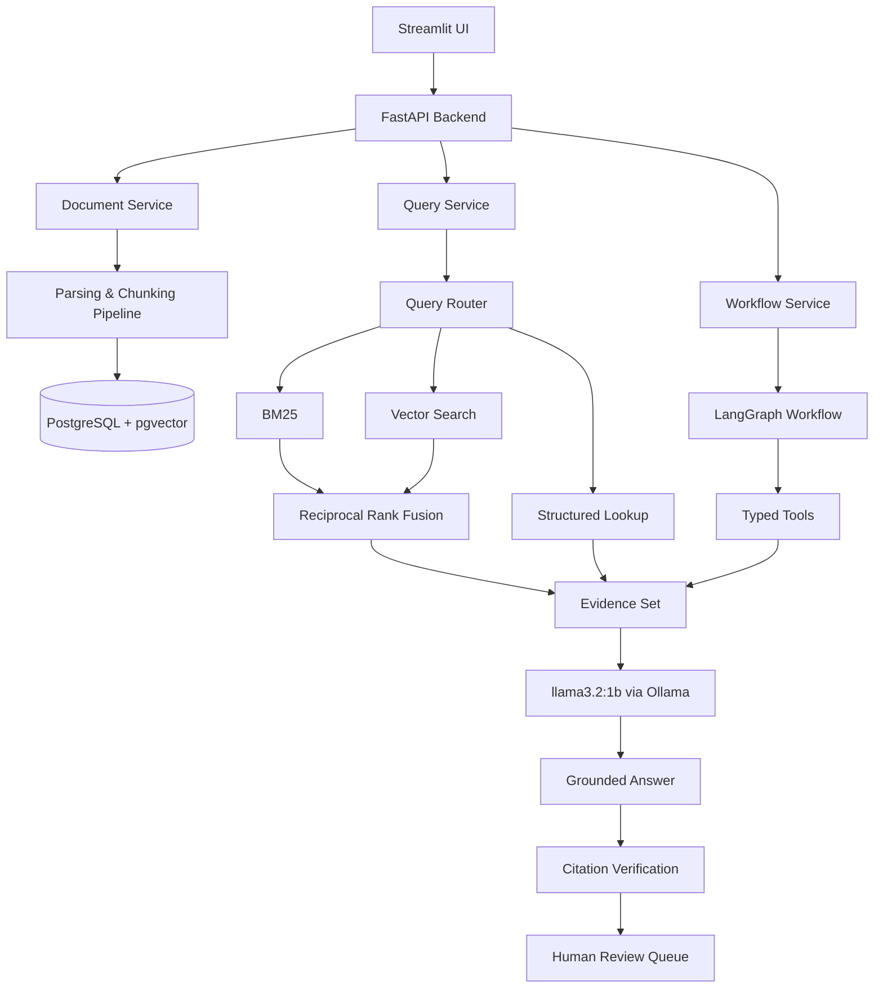

# Document Intelligence & AI Workflow Automation Platform

> A local-first AI engineering platform that converts business documents into structured knowledge, performs hybrid retrieval and cross-document reasoning, and generates evidence-backed discrepancy reports using a lightweight Ollama LLM — no paid APIs, no cloud dependency.

> 🚧 **Status: under active development.** Current milestone: project foundation. This README is updated as milestones land; no feature is listed here before it works.

## Why this project exists

Businesses handle packs of related documents — contracts, purchase orders, invoices, payment policies — where the expensive failures live *between* documents: an invoice that exceeds the contract limit, a currency mismatch, payment terms that silently drift from what was agreed. Checking this by hand is slow and error-prone; handing it to an unconstrained LLM chatbot is unreliable and unauditable.

This project takes a different approach: **a small local model (Llama 3.2 1B) wrapped in a deliberately engineered system** — deterministic retrieval, schema-validated structured outputs, Python-computed financial checks, verifiable citations, and human approval before any consequential action. The goal is to demonstrate that reliability comes from system design, not model size.

## Architecture



## Designed for consumer hardware

This platform is deliberately designed to run end-to-end on a mid-range laptop:

```text
AMD Ryzen 5 6600H · 16 GB RAM · RTX 3050 4 GB · Windows 11
```

That constraint is a feature, not an apology: every component is chosen for memory efficiency — a 1B generative model, a dedicated lightweight embedding model, pgvector instead of a dedicated vector database, and no Kubernetes/Elasticsearch/heavyweight observability stack.

## Setup

Prerequisites: Python 3.12+, Docker Desktop, [Ollama](https://ollama.com) running on the host.

```bash
# 1. Models (one-time)
ollama pull llama3.2:1b
ollama pull all-minilm

# 2. Database
docker compose up -d postgres

# 3. Python environment
python -m venv .venv
# Windows: .venv\Scripts\activate    Linux/macOS: source .venv/bin/activate
pip install -e ".[dev]"

# 4. Configuration
cp .env.example .env

# 5. Run the API
uvicorn app.api.main:app --reload
```

Verify readiness (checks PostgreSQL, Ollama, and required models, with actionable hints if something is missing):

```bash
curl http://localhost:8000/ready
```

## Run tests

```bash
pytest -m "not ollama and not integration"   # fast suite, no local services needed
pytest                                        # full suite (requires Postgres + Ollama)
```

## Evaluations

This project ships with a reproducible evaluation suite (retrieval, extraction, routing, discrepancy detection, citations, workflow success, latency) against a deterministic synthetic benchmark. **No metrics are reported anywhere in this repository unless they were produced by these scripts.**

```bash
python -m evals.run_all   # (available from Milestone 3 onward)
```

## License

MIT © Arthur Nguyen
